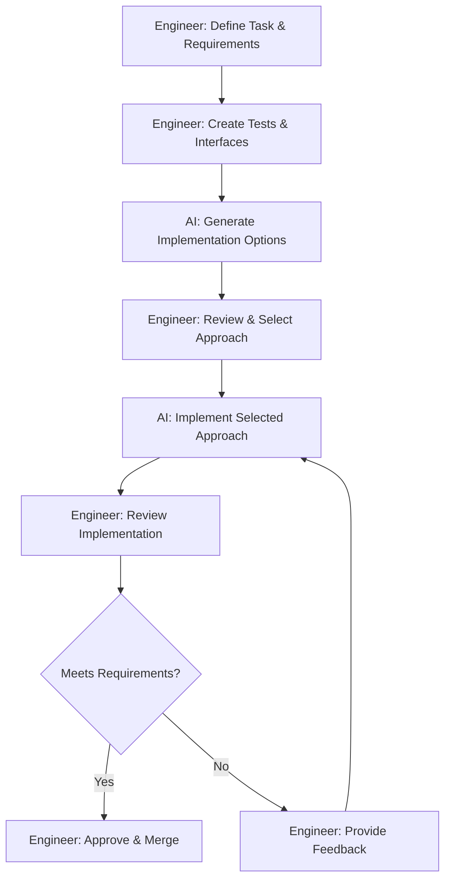

# Workflow Design for Agent-Based Coding

## Introduction

Designing effective workflows is essential for integrating AI coding agents into your development process. Well-designed workflows help engineers orchestrate AI agents efficiently while maintaining quality and control.

## AI-Enhanced Development Cycles

As an engineer orchestrating AI agents, design development workflows that leverage AI strengths:

1. **AI-Assisted Planning**:
   - Engineer defines requirements and constraints
   - AI helps decompose tasks into implementation steps
   - Engineer reviews and refines the implementation plan

2. **Progressive Implementation**:
   - Engineer establishes interfaces and test criteria
   - AI implements initial functionality based on guidance
   - Engineer reviews, tests, and refines implementations

3. **Collaborative Review**:
   - Engineer sets review criteria
   - AI explains code and identifies potential issues
   - Engineer makes final quality judgments

## Task Delegation Strategy

As the orchestrator, determine what tasks to delegate to AI agents:

| Ideal for AI | Better for Human Engineers |
|--------------|----------------------------|
| Boilerplate code generation | Critical business logic |
| Repetitive implementations | Architecture decisions |
| Test case generation | Security-sensitive code |
| Documentation drafting | Complex algorithm design |
| Refactoring and optimizations | UX decisions |

## Prompt Engineering Approach

Establish guidelines for effective prompting:

1. **Prompt Templates**:
   - Create standardized templates for common tasks
   - Include context references (using @ symbol in Cursor)
   - Specify expected output format and quality criteria

2. **Prompt Library**:
   - Maintain a collection of effective prompts
   - Document successful prompt patterns
   - Share examples of clear instructions

3. **Context Management**:
   - Guidelines for including relevant context
   - Techniques for referencing documentation
   - Methods for providing just enough information

## Sample Development Workflow



## Engineer's Orchestration Role

In workflow design, the engineer:

1. **Directs the Process**: Sets requirements, acceptance criteria, and milestones
2. **Provides Critical Judgment**: Evaluates AI outputs against engineering standards
3. **Maintains Quality Control**: Ensures all deliverables meet project requirements
4. **Handles Exceptions**: Steps in when AI reaches its limitations

## Sample Workflow Guidelines Document

```markdown
# AI-Assisted Development Workflow

## Requirements Definition
- Engineer defines clear requirements with acceptance criteria
- Engineer identifies constraints and edge cases
- Engineer determines what parts can be delegated to AI

## Implementation
- Engineer creates interfaces and test skeletons
- AI generates implementation options
- Engineer reviews and selects approach
- AI implements selected approach
- Engineer reviews, tests, and refines

## Review and Acceptance
- Engineer reviews implementation against requirements
- Engineer ensures code meets project standards
- Engineer verifies edge case handling
- Engineer accepts or provides feedback for refinement
```

## Next Steps

After designing your workflow:

1. Document your workflow process
2. Create initial prompt templates
3. Establish review criteria
4. Proceed to [Security and Quality Planning](./04-security-quality-planning.md)

Remember that as the engineer, you orchestrate the workflow. AI agents assist within the workflow, but you define the process, set the standards, and make the critical decisions that ensure project success.
